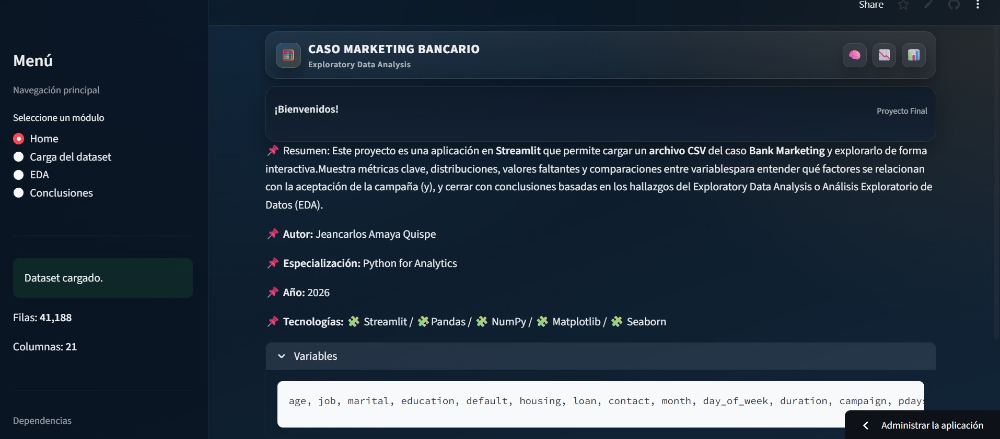
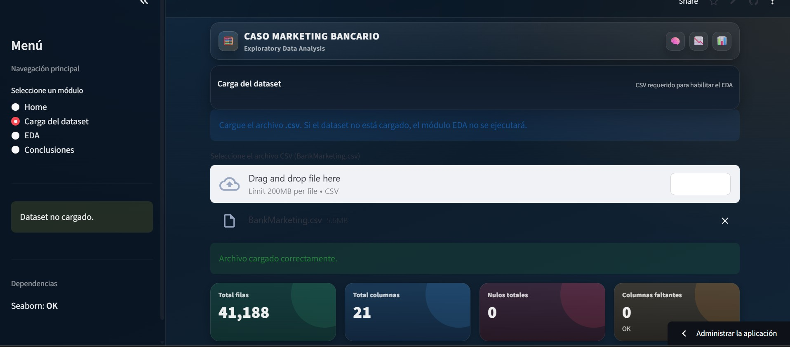
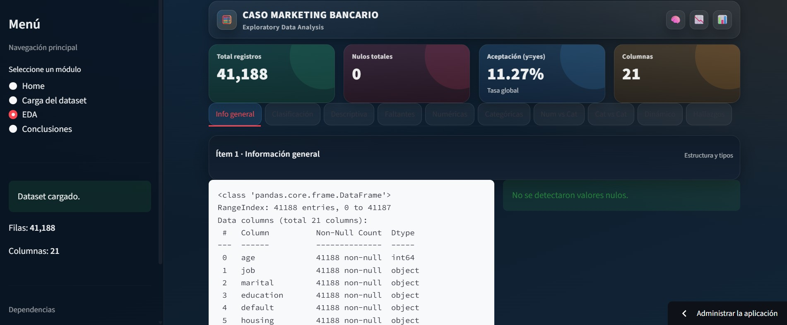
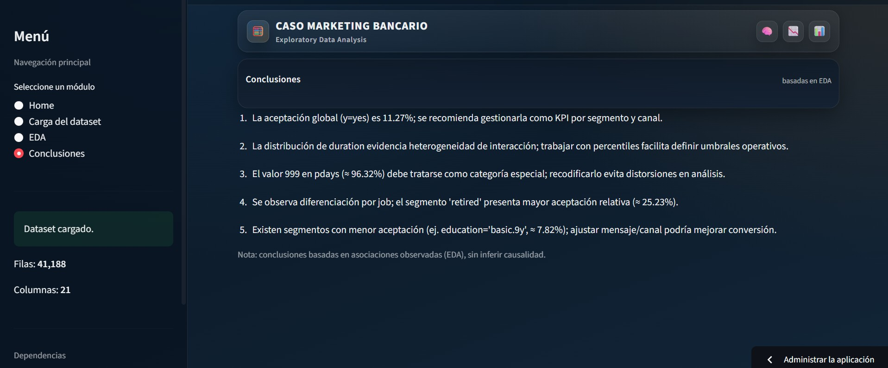

# Bank Marketing – Exploratory Data Analysis (EDA)


Aplicación interactiva desarrollada en **Streamlit** para realizar **EDA (Exploratory Data Analysis)** sobre el dataset **Bank Marketing**.
Permite cargar un archivo **CSV**, evaluar calidad de datos, estadísticas descriptivas, distribuciones, relaciones entre variables y generar conclusiones basadas en hallazgos.

---

## ✅ Objetivo del proyecto
Analizar patrones y relaciones entre variables del dataset y su vínculo con la variable objetivo **`y`** (aceptación de campaña), a través de un flujo EDA estructurado y reproducible.

---

## Autor
- **Nombre:** Jeancarlos Amaya Quispe  
- **Especialización:**  Python for Analytics  
- **Año:** 2026

---

## 🧩 Alcance funcional
La app incluye módulos navegables desde el **sidebar**:

- **Home:** descripción general del proyecto
- **Carga del dataset:** subida y validación del CSV
- **EDA:** análisis exploratorio (10 ítems con tabs)
- **Conclusiones:** síntesis final basada en el EDA

---

## 🖼️ Capturas de la app

| Pantalla | Vista |
|---|---|
| Home |  |
| Carga del dataset | |
| EDA (tabs) |  |
| Conclusiones | |


---

## 📁 Estructura
```text
JEANCARLOS_AQ/
├─ ✅ app.py
├─ ✅ requirements.txt
├─ ✅ BankMarketing.csv
├─ ✅ README.md
└─ ✅ screenshots
      ├─ 📌 home.png
      ├─ 📌 carga_dataset.png
      ├─ 📌 eda_tabs.png
      └─ 📌 conclusiones.png
